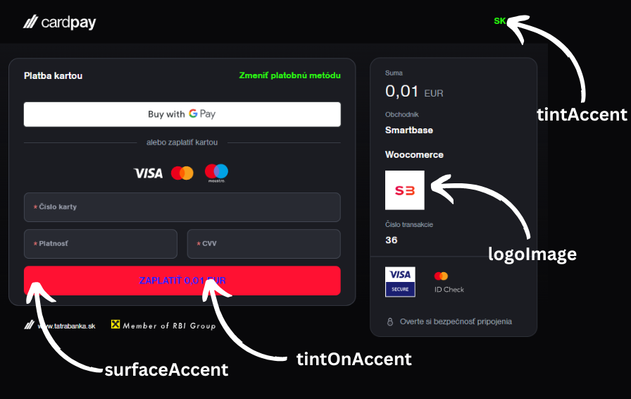

import CodeBlock from '@theme/CodeBlock';

# Gateway appearances

Payment gateway can have custom colors and logo.

:::warning

Gateway appearances can be change only in **PRODUCTION** mode.

:::

## Logo

import setLogo from '!!raw-loader!../../../../code_samples/node/v1/setLogo';

<CodeBlock language="jsx">{setLogo}</CodeBlock>

## Colors

import setColors from '!!raw-loader!../../../../code_samples/node/v1/setColors';

<CodeBlock language="jsx">{setColors}</CodeBlock>

:::tip

Changes are reflected only in **new payments**. Refresh of page is not sufficient.

:::

<Button label="See full API reference" link="/docs/api/set-appearance"/>